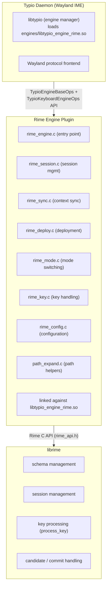

# librime Integration

This document describes how `typio-engine-rime` integrates with librime and how it maps librime concepts onto the Typio engine ABI. Source paths refer to this repository's `src/`. (Older Typio docs may still read `engines/rime/`; that path corresponds to `src/` here.)

> Output-API note: under the `libtypio` repository's ADR-0006 (composition as state, commit as event) the engine emits one transactional **composition** (preedit + candidates) via `typio_input_context_set_composition`, plus `typio_input_context_commit` for finalized text. The walkthrough below still names the pre-migration `set_preedit`/`set_candidates` calls in places; the data extracted from librime is identical — only the emit call changes (the two values are filled into one `TypioComposition` instead of two separate calls).

## 1. Architecture Overview

Typio integrates librime via a **plugin engine**. The Rime engine lives in the `typio-engine-rime` repository, compiles to a shared library `libtypio_engine_rime.so`, and is loaded at runtime by the host's plugin loader.



## 2. Core Data Structures

### 2.1 Engine Global State (TypioRimeState)

Each Rime engine instance (`TypioEngine`) stores its `user_data` as a `TypioRimeState`:

```c
typedef struct TypioRimeState {
    RimeApi *api;              // librime API function table pointer
    RimeTraits traits;         // init traits (data dirs, distribution info)
    TypioRimeConfig config;    // config (shared_data_dir, user_data_dir, schema)
    bool initialized;          // whether initialize() has completed
    bool maintenance_done;     // whether deployment has finished
    uint32_t deploy_id;        // deployment version, used for session invalidation
    /* Cached from the last notification callback */
    bool ascii_mode;           // cached ascii_mode from option notification
    bool ascii_mode_known;     // whether ascii_mode has been received
} TypioRimeState;
```

### 2.2 Input Context Session (TypioRimeSession)

**Key design**: Rime sessions belong to `TypioInputContext` (stored via property), not to transient focus state. Losing focus only clears the screen; the session survives until the context is destroyed, preserving runtime options such as `ascii_mode` across focus changes and engine switches.

```c
typedef struct TypioRimeSession {
    TypioRimeState *state;
    RimeSessionId session_id;    // librime session ID
    bool ascii_mode_known;       // whether we have read the current ascii_mode
    bool ascii_mode;             // cached ascii_mode value
    uint32_t deploy_id;          // deploy_id at session creation time
} TypioRimeSession;
```

### 2.3 Engine Capability Flags

```c
.capabilities = TYPIO_CAP_PREEDIT 
              | TYPIO_CAP_CANDIDATES 
              | TYPIO_CAP_PREDICTION 
              | TYPIO_CAP_LEARNING
```

Supports: preedit text, candidate list, prediction, and user dictionary learning.

## 3. Lifecycle Management

### 3.1 Initialization (`typio_rime_init`)

1. **Load config**: reads the `[engines.rime]` section from `typio.toml`
   - `shared_data_dir`: system Rime data directory (default `/usr/share/rime-data`)
   - `user_data_dir`: user data directory (default `~/.local/share/typio/rime`)
   - `schema`: default schema ID
2. **Ensure directory exists**: automatically creates `user_data_dir`
3. **Get API**: calls `rime_get_api()` to obtain the function table
4. **Log version**: calls `api->get_version()` and logs the linked librime version for troubleshooting
5. **Set Traits**:
   ```c
   traits.shared_data_dir = ...;
   traits.user_data_dir = ...;
   traits.distribution_name = "Typio";
   traits.app_name = "rime.typio";
   ```
6. **Initialize librime, in order**: `setup(&traits)` → `set_notification_handler()` → `initialize(&traits)`.  librime requires `setup()` to be called before any other API function (see `rime_api.h`), so the notification handler is registered *after* `setup()` but *before* `initialize()`/maintenance — early enough to still receive all deploy and option events.
7. **Trigger deployment**: if `build/default.yaml` does not exist, starts an async deployment

### 3.2 Destruction (`typio_rime_destroy`)

1. Calls `api->finalize()` to shut down librime
2. Frees config strings and the state structure

## 4. Session Management

### 4.1 Get / Create Session (`typio_rime_get_session`)

```c
TypioRimeSession *typio_rime_get_session(TypioEngine *engine,
                                         TypioInputContext *ctx,
                                         bool create);
```

Logic:
1. Look up an existing session from `ctx` property (key: `"rime.session"`)
2. **Deployment check**: if `session->deploy_id != state->deploy_id`, the session is stale; clean it up and recreate
3. If creation is requested and deployment is done:
   - `api->create_session()` to create a new session
   - `api->select_schema()` to apply the configured schema
   - `api->get_status()` to verify the schema was actually applied (logs mismatch)
   - Store in `ctx` property with destructor callback `typio_rime_free_session`
   - Sync initial mode state

### 4.2 Handling During Deployment

If librime is deploying (`maintenance_done` is false and `is_maintenance_mode()` returns true):
- `get_session(..., true)` returns `NULL`
- `process_key` shows a temporary preedit message `"… Rime 正在部署"`
- Keys are marked as `HANDLED` to prevent input leakage
- When the async deployment finishes, the `"deploy"` / `"success"` notification sets `maintenance_done = true`

## 5. Key Event Processing

### 5.1 Key Translation

Typio's `TypioKeyEvent` is translated into librime `process_key` arguments:

```c
// Modifier mapping
Typio MOD_SHIFT   → RIME_SHIFT_MASK (1 << 0)
Typio MOD_CTRL    → RIME_CONTROL_MASK (1 << 2)
Typio MOD_ALT     → RIME_MOD1_MASK (1 << 3)
Typio MOD_SUPER   → RIME_MOD4_MASK (1 << 6)
Typio MOD_CAPSLOCK→ RIME_LOCK_MASK (1 << 1)
Typio MOD_NUMLOCK → RIME_MOD2_MASK (1 << 4)

// Release event
TYPIO_EVENT_KEY_RELEASE → TYPIO_RIME_RELEASE_MASK (1 << 30)
```

### 5.2 Processing Flow (`typio_rime_process_key`)

```
1. Escape key: if there is preedit / candidates, reset and consume
2. Get / create session (if deploying, show waiting message)
3. Bare Shift handling (engine-managed, bypasses librime key_binder):
   - Shift press: set shift_held + shift_only flags, consume immediately
   - Bare Shift release (no other keys pressed during hold):
     a. Extract raw ASCII from preedit and commit as text
     b. Clear librime composition
     c. Toggle ascii_mode via set_option()
     d. Clear Typio composition and publish status
   - Non-bare Shift release: consume without side effects
   - Any non-Shift key press clears shift_only flag
4. Call api->process_key(session_id, keysym, mask) for all other keys
5. If handled:
   a. flush_commit() — retrieve committed text and commit to Typio
   b. sync_context() — sync preedit and candidates to TypioInputContext
6. Return: COMMITTED / COMPOSING / HANDLED / NOT_HANDLED
```

The bare Shift handler runs before `api->process_key` to avoid librime's
schema-dependent `key_binder` behavior. Different Rime schemas bind Shift
differently (or not at all), which previously caused the candidate panel to
disappear while the preedit remained underlined and unresponsive. By handling
Shift at the engine boundary, the behavior is deterministic: bare Shift always
commits raw input and toggles mode, regardless of schema configuration.

## 6. Candidate & Preedit Synchronization

### 6.1 Context Sync (`typio_rime_sync_context`)

Extracts data from librime's `RimeContext`:

**Preedit text**:
```c
if (rime_context.composition.preedit) {
    TypioPreeditSegment segment = {
        .text = preedit,
        .format = TYPIO_PREEDIT_UNDERLINE,
        .cursor_pos = rime_context.composition.cursor_pos,
    };
    typio_input_context_set_preedit(ctx, &preedit);
}
```

**Candidate list**:
- Supports `select_keys` (custom select keys) and `select_labels` (custom labels)
- Fills the candidate section of `TypioComposition` (text, comment, label, page, selected, etc.) emitted via `typio_input_context_set_composition`
- Small pages (≤10) use stack allocation; large pages use heap allocation

### 6.2 Synchronization Model

`sync_context()` performs a single, straightforward **full sync** on every handled key: it pulls the current `RimeContext`, rebuilds the preedit, and rebuilds the candidate list. The engine intentionally does **not** try to detect "selection-only" changes itself. An earlier engine-side dual-path optimisation was removed because it duplicated change-detection already done downstream and recomputed candidate labels twice on a mispredict, adding work on the hot candidate-navigation path without a real payoff.

The lag-sensitive work is gated by the Wayland frontend, not by the engine:

- The preedit/candidate callbacks only set a `popup_update_pending` flag; the actual render is deferred to the event-loop flush, so a burst of keystrokes (e.g. key auto-repeat) collapses into one render instead of blocking the message loop.
- At flush time the frontend independently checks whether the preedit text changed and **skips the expensive application protocol round-trip** when only the highlighted candidate moved.

Because that coalescing and the protocol-skip already happen downstream, the engine can safely re-send the (unchanged) preedit and full candidate list each keystroke — copying ~10 short strings is negligible next to the render/IPC it no longer triggers.

Slow-sync detection: if a sync takes ≥ 8 ms (`TYPIO_RIME_SLOW_SYNC_MS`), a debug line is logged (session_id, candidate count, page number, etc.).

### 6.3 Commit Text (`typio_rime_flush_commit`)

```c
if (api->get_commit(session_id, &commit)) {
    if (commit.text && *commit.text) {
        typio_input_context_commit(ctx, commit.text);
    }
    api->free_commit(&commit);
}
```

## 7. Deployment & Config Reload

### 7.1 Deployment Mechanism

- **Auto-deployment**: on startup, if `build/default.yaml` is missing, triggers a full deployment
- **Notification-driven tracking**: `set_notification_handler` receives `"deploy"` / `"success"` or `"failure"` events, setting `maintenance_done` without polling `is_maintenance_mode()`
- **Explicit deployment**: when requested via D-Bus or control panel:
  1. `invalidate_generated_yaml()`: delete `.yaml` files under `build/` (librime tracks changes with second-level timestamps; multiple modifications within the same second require forced invalidation)
  2. `start_maintenance(full_check=true)`: start the librime deployment thread
  3. `deploy_id++`: mark all existing sessions as stale; they will be recreated on next use

### 7.2 Config Reload (`typio_rime_reload_config`)

```
1. If deployment was requested:
   - invalidate generated YAML
   - run maintenance (deploy)
2. Update schema config
3. Read [engines.rime] config section
   - changes to shared_data_dir / user_data_dir require Typio restart (warning log)
4. apply_runtime_config():
   - re-acquire session for the current focused context (create=true triggers recreation)
   - clear current composition
   - apply new schema
   - sync context
```

### 7.3 Environment Variables

- `TYPIO_RIME_SYNC_DEPLOY=1`: force synchronous (blocking) deployment, useful for debugging

## 8. User Dictionary (Learning & Persistence)

### 8.1 Local Learning — Automatic, Works Today

Typio advertises `TYPIO_CAP_LEARNING`, and user-dictionary learning works out of the box. All of it happens **inside librime**: when text is committed, librime's `Memory` module records the choice into a per-schema user database — a LevelDB directory at `<user_data_dir>/<schema>.userdb/` — incrementing the entry's commit count, recency, and decay factor. This is what promotes frequently/recently chosen candidates over time.

Key properties:

- **The engine does not — and cannot — drive this per keystroke.** Typio only calls `process_key` / `get_commit`; librime performs the learning write automatically on each commit via its commit-notifier hook. There is no Rime C-API call to skip or force an individual learning write.
- **Persistence is incremental and durable.** Each write goes to the userdb's LevelDB write-ahead log immediately and is replayed on reopen, so learning survives restarts. `finalize()` closes the database cleanly on shutdown.
- **Whether learning happens is controlled by schema config**, not by Typio code. The relevant schema keys are `<translator>/enable_user_dict` (default `true`), `<translator>/user_dict` (which userdb file), and `<translator>/db_class`. To disable learning for a schema, patch `default.custom.yaml`:
  ```yaml
  patch:
    "translator/enable_user_dict": false
  ```

Because the user database lives under `user_data_dir` (`~/.local/share/typio/rime` by default), it is preserved across restarts and upgrades.

### 8.2 Cross-Device Sync (`sync_user_data`) — Not Planned

librime also exposes `sync_user_data()`, a **separate** cross-installation backup / merge mechanism. One call schedules deployer tasks that export each user dictionary to a plain-text snapshot (`<schema>.userdb.txt`) in a *sync directory* and merge in snapshots that other devices/installations left there — i.e. it lets you carry accumulated learning between machines or keep a portable text backup. It is unrelated to how local learning is normally saved.

**Typio does not call `sync_user_data()`, and implementing it is not planned.** It sits above the scope of a basic input method: Typio's job is typing plus local learning, both of which already work (see 8.1). Cross-device dictionary sync brings extra surface — a configurable sync directory, conflict/merge semantics, scheduling, and UI — that does not belong in the core IME. Users who want it can simply back up / sync `user_data_dir` themselves; it could become an opt-in feature later if there is real demand. This decision affects only *sharing* learning across machines; **local learning and persistence are fully functional and unaffected.**

## 9. Mode Switching

The Rime engine exposes two modes:

| Mode    | mode_class | Label | Icon                |
|---------|-----------|-------|---------------------|
| Chinese | `NATIVE`  | 中    | `typio-rime`        |
| ASCII   | `LATIN`   | A     | `typio-rime-latin`  |

- Mode is determined by Rime's `ascii_mode` option
- **Engine-managed bare Shift** (primary): the engine intercepts bare Shift
  press/release at the `process_key` boundary, bypassing librime's schema-dependent
  `key_binder`. On bare Shift release, the engine commits raw preedit, clears
  composition, and toggles `ascii_mode` via `set_option("ascii_mode", ...)`.
  This guarantees deterministic behavior regardless of schema configuration.
- **Notification-driven** (secondary): the notification handler receives
  `"option"` / `"ascii_mode"` events from librime for mode changes triggered by
  other means (e.g., `Shift+Space`, F4 menu, schema hotkey) and pushes them to
  Typio via `typio_instance_notify_mode()`.
- **Explicit toggle**: set `ascii_mode` option via `set_mode("ascii" / "chinese")`
- **Persistence**: mode state is preserved for the lifetime of the session

## 10. Focus & Lifecycle Events

| Event      | Behavior                                                                 |
|-----------|--------------------------------------------------------------------------|
| `focus_in` | Get / create session, reset `shift_held`/`shift_only` flags, sync current context state                         |
| `focus_out`| `reset()` — clear screen, but keep the session                           |
| `reset`    | Clear `shift_held`/`shift_only` flags, `clear_composition()` + clear Typio preedit / candidates + restore mode notification |

## 11. Interaction Points with the Typio Framework

### 11.1 Calling Typio APIs

The Rime engine, as a plugin, interacts with Typio core via:

**Input / Output** (see `libtypio` ADR-0006 — composition as state, commit as event):
- `typio_input_context_set_composition(ctx, comp)` — set preedit + candidates atomically (an empty composition clears them)
- `typio_input_context_commit(ctx, text)` — commit finalized text (separate ordered event)

**Context properties**:
- `typio_input_context_get_property(ctx, key)` — retrieve session
- `typio_input_context_set_property(ctx, key, data, destructor)` — store session

**Mode notification**:
- `typio_instance_notify_mode(instance, mode)` — notify mode change

**Config retrieval**:
- `typio_instance_get_engine_config(instance, "rime")` — get engine config section
- `typio_instance_dup_rime_schema(instance)` — get persisted schema ID
- `typio_instance_rime_deploy_requested(instance)` — check if deployment was requested

### 11.2 Called by Typio

Registered via the dual-vtable architecture (`TypioEngineBaseOps` + `TypioKeyboardEngineOps`):

```c
static const TypioEngineBaseOps typio_rime_base_ops = {
    .init = typio_rime_init,
    .destroy = typio_rime_destroy,
    .focus_in = typio_rime_focus_in,
    .focus_out = typio_rime_focus_out,
    .reset = typio_rime_reset,
    .reload_config = typio_rime_reload_config,
};

static const TypioKeyboardEngineOps typio_rime_keyboard_ops = {
    .process_key = typio_rime_process_key,
    .get_mode = typio_rime_get_mode,
    .set_mode = typio_rime_set_mode,
};
```

This design separates mandatory lifecycle operations from keyboard-specific callbacks, enforced at compile time rather than runtime NULL checks.

### 11.3 Build Integration

**Cargo** (`typio-engine-rime/Cargo.toml`):

```toml
[package]
name = "typio-engine-rime"
version = "0.1.0"
edition = "2021"

[lib]
name = "typio_engine_rime"
crate-type = ["cdylib"]

[dependencies]
libc = "0.2"
librime-sys = { path = "librime-sys" }
```

- Compiled as a `cdylib` (plugin `.so`)
- Installed to the engine directory (default `${prefix}/lib/typio/engines/`)
- Discovers and links librime via `pkg-config`

## 12. librime Documentation & Links

### Official Resources

| Resource                 | Link                                                              |
|--------------------------|-------------------------------------------------------------------|
| **librime repository**   | https://github.com/rime/librime                                   |
| **librime API docs**     | https://github.com/rime/librime/wiki/RimeApi                      |
| **Rime schema collection**| https://github.com/rime/plum                                     |
| **Rime official Wiki**   | https://github.com/rime/home/wiki                                 |
| **librime header**       | https://github.com/rime/librime/blob/master/src/rime_api.h        |

### Key API Notes

- `RimeApi`: function table struct; all librime operations go through this table.  In librime 1.0+ every function pointer is guaranteed to be non-NULL after `setup()`, so defensive NULL checks are unnecessary.
- `RimeTraits`: initialization parameters, including data directories, distribution name, etc.
- `RimeSessionId`: session identifier; independent per input context
- `RimeContext`: current composition state (preedit, candidates, menu, etc.)
- `RimeCommit`: committed text
- `RimeStatus`: current schema and option state (schema_id, is_ascii_mode, etc.)
- `process_key`: process a single key press
- `select_schema`: switch input schema
- `set_option` / `get_option`: runtime options (e.g., `ascii_mode`)
- `set_notification_handler`: async deploy / option event delivery (replaces polling)
- `get_version`: linked librime version string (logged on init for troubleshooting)
- `get_status` / `free_status`: verify schema selection and read option state
- `start_maintenance` / `is_maintenance_mode`: deployment management
- `sync_user_data`: cross-installation user-dictionary backup/merge — **not used by Typio** (see §8.2); local learning is automatic and does not require it

### Internal Typio References

| Document              | Repository / Path                       | Description                        |
|-----------------------|-----------------------------------------|------------------------------------|
| Engine integration guides | `libtypio`: `docs/how-to/integrate-keyboard-engine.md`, `docs/how-to/integrate-voice-engine.md` | How to add a new engine |
| Engine reference      | `libtypio`: `docs/reference/engines.md` | Description and config keys of every engine |
| Engine Operations     | `libtypio`: `docs/reference/plugin-abi/ops.md` | Full `TypioEngineBaseOps` / `TypioKeyboardEngineOps` definition |
| Architecture overview | `libtypio`: `docs/explanation/architecture-overview.md` | Typio overall architecture |

## 13. File List

```
typio-engine-rime/src/
├── rime_engine.c      # entry point, notification handler, ops wiring
├── rime_session.c     # librime session lifecycle per input context
├── rime_sync.c        # preedit / candidate / commit synchronisation
├── rime_key.c         # modifier mask translation, keysym selection, bare-Shift state machine
├── rime_mode.c        # Chinese / ASCII mode detection and notification
├── rime_deploy.c      # deployment and maintenance management
├── rime_control.c     # command surface (deploy, setup) and config-change hook
├── rime_config.c      # configuration loading from Typio instance
├── rime_setup.c       # rime-ice download and installation
├── rime_utils.c       # small utility helpers (monotonic time, directory creation)
├── path_expand.c      # path expansion (~, $HOME, ${VAR})
└── rime_internal.h    # shared declarations for all modules
```

The implementation is split into focused modules so each file has a single responsibility:

| File | Lines (approx.) | Responsibility |
|------|----------------|----------------|
| `rime_engine.c` | ~390 | Engine entry point, notification handler, `TypioEngineBaseOps` wiring |
| `rime_key.c` | ~130 | Modifier mask translation, keysym selection, bare-Shift press/release handler |
| `rime_sync.c` | ~170 | Convert librime `RimeContext` → `TypioInputContext` (preedit, candidates, commit) |
| `rime_session.c` | ~180 | Create / destroy / validate `RimeSessionId`, schema selection with `get_status` |
| `rime_mode.c` | ~190 | ASCII ↔ Chinese mode detection, status publication, schema write-back |
| `rime_deploy.c` | ~120 | Trigger and track librime deployment |
| `rime_control.c` | ~150 | Command surface (deploy, setup) and config-change hook |
| `rime_config.c` | ~60 | Load `[engines.rime]` settings from Typio config |
| `rime_setup.c` | ~150 | rime-ice download and installation |
| `rime_utils.c` | ~60 | `mkdir -p`, path existence, YAML suffix check |
| `path_expand.c` | ~170 | `~` and `$VAR` expansion in paths |

This modular layout keeps the engine consistent with Typio's project-wide convention: `basic.c` (~250 lines) and `mozc_engine.cc` are also organised by lifecycle → input → output → config.
